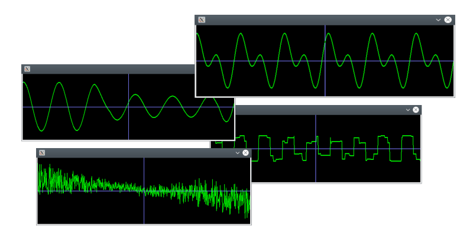

# synth



Real time dynamic sound generator / library. 

Note: Some crackles have been fixed.
[Listen the demo here](tests/synth.ogg), please not that many  cracklings have been removed since the time I've recorded the demo.

Also, a good code sample for SDL AudioDevice real time manipulation.

You, developper may want to use only the end of the synth.cpp file (from void audioCallback(...) to the end).

This one file c++ file is able to generate very complicated sound such as a synthetiser.

The library allows to create sounds that are continuously generated and updated.
For example, a sinus generator may follow smoothly and in real time a float value (frequency) that changes in the main program.

# features

* Very simple to add to existing project :

##  Minimal examples :
  1/ Test under bash > synth 1000 sinus 1000
  2/ Add to C++ : SoundGenerator::play(SoundGenerator::factory("sinus 1000")); usleep(1000000);
     That's all !

  3/ Simple Hooks : C++ hook allowing to modify dynamically a sound :

  ```c++
  class SpeedHook : public SoundGeneratorVarHook<float>
  {
     SpeedHook() :: SoundGeneratorVarHook(&speed, 0, 200, "hook_speed")
     atomic<float> speed;  // from 0 to 200
  }

  SpeedHook* engine_speed = new SpeedHook();
  SoundGenerator::play(SoundGenerator::factory("fm 50 150 sinus 440 hook_speed"));
  
  while(true) {
      ... 
      engine_speed.speed = 30;   <- sound will adapt accordingly
      ...
  }
  ```

  It is also possible to store sound definition in files.

  in C++ :
  ```c++
  SoundGenerator::factory("mysound.synth");
  ```
  cmdline: synth mysound.synth

## Sound definition that can be reused for any kind of use (modulator, sound, envelop etc)

> synth define engine { sinus 440 square 215:15 } engine

## Audio features

* No hard limit to number of voices mixed together

Any combinaison of arbitrary number of these :

* sinus
* square (no eptr)
* blep (lot better square, with 
* triangle / sawtooth
* distorsion
* white noise
* reverberation / echo
* low / high / band filter (in progress)
* clamp

* frequency modulation (any signal)
* amplitude modulation (any signal)
* attack decay sustain release hold delay enveloppe (adsr)
* custom envelope (from file also)

* left/right cut channel
* mono converter
* sound mixer
* avc (automatic volume control)

* chain of sounds (sequence)
* external hooks sound generator (mouse sound demo)

* factory from string / stream
* sounds can be stored in more friendly files
* custom frequencies definition (see frequencies.def)

## Misc features

* one command line => very complicated sounds

  see examples for more.

* sound definitions can be stored as file
* enveloppe definitions can be stored in files

* easy to integrate to existing project

* frequencies.def file can be filled with notes frequencies making it easy to
write some small musics synth files.
```
262 DO C
277 DO# REb C# Db
294 RE D
311 RE# MIb D# Eb
330 MI E
349 FA F
370 FA# SOLb F# Gb
392 SOL G
415 SOL# LAb G# Bb
440 LA A
466 LA# SIb A# Bb
494 SI B
```
And thus it is possible to play a little song :

```bash
cd tests  <--- important because the frequencies.def file must be in current directory
synth 8000 chain ms 250 gen sinus DO x2 RE MI x2 FA SOL LA SI mix 50 loop
```

x2 are equivalent to 250x2
mix 50 avoids transitions clicks 

Example of a engine noise that accelerates

```bash
 > ./synth 30000 reverb 10:50 fm 0 150 am 0 100 triangle 100:50 square 39 adsr 1:0 1000:0 2000:100 5001:400 6000:400 8000:-100 9000:0 loop level 1
 ```

 The corresponding description file could be

```
 define engine
 {
	fm
		0 150 
		am 
			0 100
			triangle 100:50
			square 39
		adsr
			1:0 1000:0 2000:100 5001:400 6000:400 8000:-100 9000:0 loop
			level 1
 }

 reverb 10:50 engine
```

This kind of file is easier to read.
engine is a sound defined by a fm modulator.

The base sound is am 0 100 triangle 100:50 square 39.
One can ear that sound by using the synth utility.

```bash
> synth am 0 100 triangle 100:50 square 39
```

  The base sound is a triangle@100Hz (50% volume so the reverb will not saturate).
  The base sound is chopped @39Hz by the am modulator.

  Then, the result is modulated (frequency) by the fm modulator.

  The fm modulator takes 4 arguments, in the engine example :
   
* 0 min frequency factor (0 => 0Hz => no sound)
* 140 max frequecy factor (triangle @ 100Hz * 1.5)
* am ... The sound that will be modulated
* adsr any generator, values produced are used to modulate frequency.

  The envelope (adsr) produces values from 0 to 1, and the result is used
  to modify the frequency modulation.

## Hooks (integration in existing software)

One may want to use this engine sound in a game, but how to modulate dynamically the sound from an
existing value (the speed of the engine in the game).

In the example, the fm modulator uses adsr that returns values from 0 to 1 to modulate the frequency.
The idea is then to replace adsr by a callback that will be responsible to return this value.

Easy => replace adsr by a name of your choice, implement the callback and enjoy !

Let say we use the name 'engine_speed' :

```
 define engine
 {
	fm
		0 150
		am
			0 100
			triangle 100:50
			square 39
		engine_speed
 }

 reverb 10:50 engine
```

And here is the C++ code to define engine_speed


```c++
atomic<float> engine_speed;	// Float value that represents the engine speed
class EngineSpeedHook : public SoundGeneratorVarHook<float>
{
	public:
		EngineSpeedHook(float &v) : SoundGeneratorVarHook(&engine_speed, 0.0, 100.0, "engine_speed"){}
};

static EngineSpeedHook instance;	// Needed to register the 'engine_speed' hook so it can be used.
```

One should create more sophisticated hooks. See mouse.cpp for the class that defines mouse_hook.


# Examples

 > synth help   (must I explain ?)

440Hz sinus for 1000ms (1s)
 > synth 1000 sin 440

Same, but volume 50%
 > synth 1000 sin 440:50

220Hz chopped sinus (5x / sec) for 1sec

 > synth 1000 am 0 100 sinus 220 square 5

Changing am from square to sinus

 > synth 1000 am 0 100 sinus 220 sinus 5

Mixing two signals, triangle @440Hz 50% volume and sinus 330Hz for 1sec

 > synth 1000 tri 443.55:50 sinus 332.29

... Hum how to define that ???

 > synth 1000000 am 0 100 fm 80 120 sq 440:25 tri 1 square 5 am 0 100 fm 80 120 sq 330:25 tri 1 square 6 fm 80 120 sinus 1200:30 sinus 3
 
 Mix sounds togethers (called a group)
 > synth { sinus 220 sinus 330 sinus 110 }

 Use group in modulator (This can produce very complex sounds)

 > synth fm 80 120 { sinus 887.10 sinus 1117.67 } sinus 5
 
